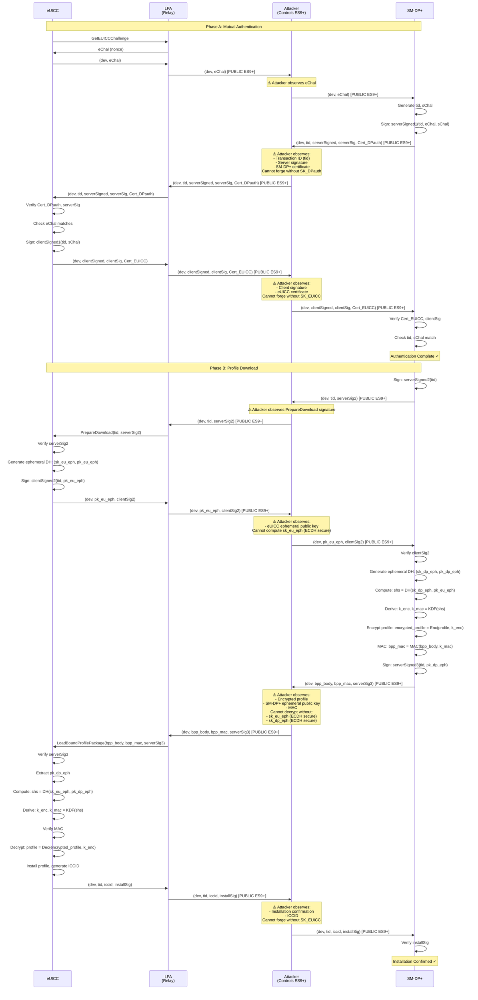

# Attack Trace: Classical RSP with Compromised TLS (Public ES9+ Channel)

## Protocol Flow with Attacker Observation

## Security Analysis

### ✅ What the Attacker CAN Observe (Public ES9+ Channel):
1. **All messages** between LPA and SM-DP+ on ES9+ interface
2. **Transaction IDs** (tid)
3. **Nonces** (eChal, sChal)
4. **Certificates** (Cert_DPauth, Cert_EUICC)
5. **Signatures** (serverSig, clientSig)
6. **Ephemeral public keys** (pk_eu_eph, pk_dp_eph)
7. **Encrypted profile packages** (encrypted_profile)
8. **MACs** (bpp_mac)
9. **Installation confirmations** (iccid, installSig)

### ❌ What the Attacker CANNOT Do (Security Properties Hold):
1. **Cannot forge signatures** without private keys (SK_DPauth, SK_EUICC)
2. **Cannot compute DH shared secret** without private ephemeral keys
3. **Cannot decrypt profile** without the shared secret
4. **Cannot impersonate** either party without private keys
5. **Cannot break forward secrecy** (ephemeral keys deleted after use)

### Key Insight:
Even with **completely compromised TLS** (public ES9+ channel), the classical RSP protocol maintains security because:
- **ECDSA signatures** provide authentication (cannot be forged)
- **Ephemeral ECDH** provides confidentiality and forward secrecy
- **Application-layer cryptography** protects the profile independently of transport security

This demonstrates that **proper application-layer security** can provide defense-in-depth even when transport security fails.
